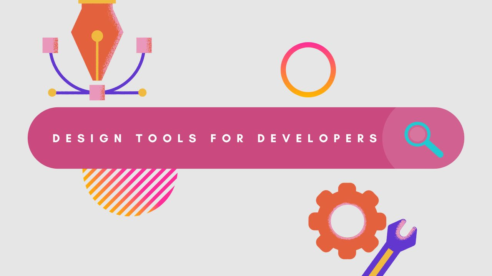

## Design Resources for Developers 2023

# Table of ontent

- UI Graphics
- Browser-Based Design Tools
- Downloadable Design Software
- Fonts
- Colors
- Icons
- Free SVG Patterns
- Others
---
## **UI Graphics**
---
> Website UI Component

| **Website** | **Description** |
| ----------- | ----------- |
| [UI Space](https://uispace.net/) | Thousands of great freebies |
| Paragraph | Text |\

___
## **Brower-based Design Tools**
---
> Photo, video editor, graphic design, wireframing tools in your browser or phone.

| **Website** | **Description** |
| ----------- | ----------- |
| [Canva](https://www.canva.com/) | Create doc, youtube Thumbnail, website and  much more with tons of buil-in templates and design elements |
| [vistacreate](https://create.vista.com/) | Tons of buil-in social media templates, logo maker, posters|
| [socialsizes](https://socialsizes.io/) | Download the correct Image and Video sizes for Social Media |
| [Photopea](https://www.photopea.com/) | Alternative for Photoshop 9Free!)|
| [PIXLR](https://pixlr.com/) | AI-powered photo editing.  Photoshop alternative created by AutoDesk|

___

## **Downloadable Design Tools**
---
> Open Source and Free Graphic design, 3D, vector tools for your desktop, tablet and phone.   **Photoshop & Illustrator** alternatives

| **Website** | **Description** | **OS** |
| ----------- | ----------- | ----------- |
| [Gimp](https://www.gimp.org/) | Image editor available.  Photoshop Alternative | Linux, macOS, Windows|
| [InkScape](https://inkscape.org/) | Vector graphics editor | Linux, macOS, Windows |
| [Krita](https://krita.org/en/) | A professional FREE and open source  painting program with a powerful brush engine.  Adobe Illustrator Alternative. | Linux, macOS, Windows |
| [Blender](https://www.blender.org/) | 3D creation suite| Linux, macOS, Windows |
| [Darltable](https://www.darktable.org/) | an image editor. Lightroom alternative. Great for beginners| Linux, macOS, Windows |
| [Paint.NET](https://www.getpaint.net/) | A simple photo editor.  Extensions are available to make if more versatile.  Great for beginners| Windows |
[PhtoScape X](http://x.photoscape.org/) | A Photo editor.  Offers the same brushes and tools as Photoshop.  Great for Beginners| Windows |
___

## **Fonts**
---
> Free and Open Source Fonts

| **Website** | **Description** |
| ----------- | ----------- |
| [Google Fonts](https://fonts.google.com/) | One of the most used free fonts resources |
| [DaFont](https://www.dafont.com/) | Thousands of great free & new fonts|
| [1001 Free Fonts](https://www.1001freefonts.com/) | Probably more than 1001 fonts!?!|
| [Dev Fonts](https://devfonts.gafi.dev/) | Archive of freely downloadable fonts + code!|
| [BeFonts](https://befonts.com/) | Beautiful fonts for personal use.  Some full licensed version need to be purchased|
| [Use Modify](https://usemodify.com/) | A large collection of free fonts  from classy to weird|
| [FF Fonts](https://www.ffonts.net/top-fonts.html) | Tons of Free fonts|

## **Colors**
---
> Color palettes, color wheels, shadows and gradients

| **Description** | **Description** |
| ----------- | ----------- |
| [colors](https://coolors.co/) | The super fast color palette generator |
| [color wheel by Canva](https://www.canva.com/colors/color-wheel/) | A simple color wheel by canva|
| [Pigment](https://pigment.shapefactory.co/) | A lovely color design tool with great UI|| 
|[Colormind](http://colormind.io/) | A color scheme generator that uses deep learning.  It can learn color styles from  photographs, movies, and popular art.|
| [ColorHexa](https://www.colorhexa.com/color-names) | List of Colors by name|
| [Color Lisa](http://colorlisa.com//) | Color Palette masterpieces from famous artists|| [Pigment](https://pigment.shapefactory.co/) |
| [Color Hunt](https://colorhunt.co/) | Popular Color Palettes for  Designers and Artists |
| [Adobe Color](https://color.adobe.com/create/color-wheel) | **Probably the most comprehensive Color Wheel, Palette. Theme & Gradient tool|
| [WebGradients](https://webgradients.com/) | Easy copy > 180 liner gradients CSS3|\

## **Icons**
---
> Free and Premium Icons, stock photos & and design tools

| **Website** | **Description** |
| ----------- | ----------- |
| [ionic](https://ionic.io/ionicons) | Premium designed icons for use in web, iOS, Android, and desktop apps.|
[flaticon](https://www.flaticon.com/) | 9.2m+ vector icons & stickers| 
[icon8](https://icons8.com/) | icons, illustrations, photos, music & design tools|
[Iconscout](https://iconscout.com/) | Free Download Vector Icons illustrations stock photos|
[Feather Icons](https://feathericons.com/) | Minimalist and Beautiful Free Open Source Icons|
[Iconfinder](https://www.iconfinder.com/) | Free and premium vector icons in SVG, PNG, CSH and AI format|
[Heroicons](https://heroicons.dev/) | MIT-licensed open source icons
[The Noun Project](https://thenounproject.com) | Icons & Photos|\
---

## **Design Inspirations**
---
> Beautiful Websites, Designers

| **Website** | **Description** |
| ----------- | ----------- |
| [httpster](https://httpster.net/) | Web design inspiration from all over the world|\
___
## **Free SVG Patterns**
---
> High-res SVG pattrns for backgrounds, supported by all modern browsers

| **Website** | **Description** |
| ----------- | ----------- |
| [SVG Background](https://www.svgbackgrounds.com/) | Customize and apply background fast. Can either download or copy attribution!|
| [paaatterns](hhttps://products.ls.graphics/paaatterns/) | For Sketch, Figma, XD, Illustrator. In png and svg|
|[Doodad.dev](https://doodad.dev/) | SVG pattern tool to make small website fast|
|[wowpatterns](https://www.wowpatterns.com/)|Tons of free & colorful SVG patterns for print and web|
|[Hero Patterns](https://heropatterns.com/) | Tools for making small websites fast|
|[Pattern Ninja](https://patterninja.com/) | Pattern-making tool with free images or download your own image to create patterns|
---
## **Others**
---
> Beautiful Websites, Designers

| **Website** | **Description** |
| ----------- | ----------- |
| [zyro](https://zyro.com/tools/image-upscaler) | AI Image Upscaler: enhance image resolution|\